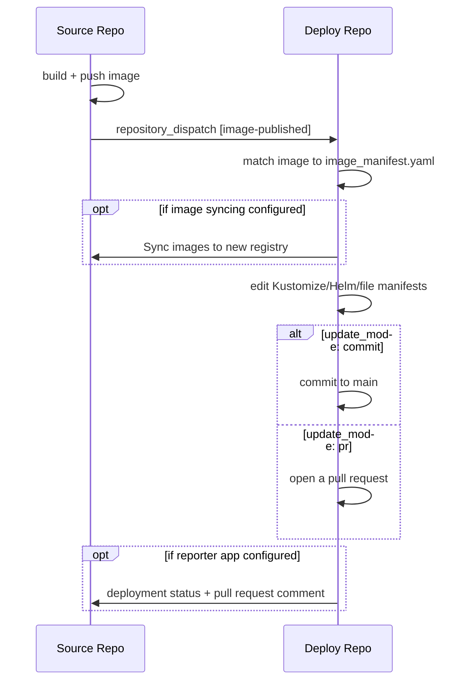

# ODP Releaser

[![Actions Status][actions-badge]][actions-link]
[![Coverage][coverage-badge]][coverage-link]
<!-- [![Documentation Status][rtd-badge]][rtd-link] -->

<!-- [![PyPI version][pypi-version]][pypi-link] -->
<!-- [![PyPI platforms][pypi-platforms]][pypi-link] -->
<!-- [![Conda-Forge][conda-badge]][conda-link] -->

<!-- [![GitHub Discussion][github-discussions-badge]][github-discussions-link] -->

<!-- prettier-ignore-start -->
[actions-badge]:            https://github.com/gulfofmaine/odp-releaser/actions/workflows/ci.yml/badge.svg
[actions-link]:             https://github.com/gulfofmaine/odp-releaser/actions
[conda-badge]:              https://img.shields.io/conda/vn/conda-forge/odp-releaser
[conda-link]:               https://github.com/conda-forge/odp-releaser-feedstock
[github-discussions-badge]: https://img.shields.io/static/v1?label=Discussions&message=Ask&color=blue&logo=github
[github-discussions-link]:  https://github.com/gulfofmaine/odp-releaser/discussions
[pypi-link]:                https://pypi.org/project/odp-releaser/
[pypi-platforms]:           https://img.shields.io/pypi/pyversions/odp-releaser
[pypi-version]:             https://img.shields.io/pypi/v/odp-releaser
[rtd-badge]:                https://readthedocs.org/projects/odp-releaser/badge/?version=latest
[rtd-link]:                 https://odp-releaser.readthedocs.io/en/latest/?badge=latest
[coverage-badge]:           https://codecov.io/github/gulfofmaine/odp-releaser/branch/main/graph/badge.svg
[coverage-link]:            https://codecov.io/github/gulfofmaine/odp-releaser

<!-- prettier-ignore-end -->

<!-- --8<-- [start:overview] -->

ODP Releaser is a Python CLI tool and a set of GitHub Action workflows to help
make deployment of Docker images to private repos more secure.

It takes advantage of GitHub's
[`repository_dispatch` event](https://docs.github.com/en/actions/reference/workflows-and-actions/events-that-trigger-workflows#repository_dispatch)
to communicate image changes to the private deployment repos, authenticated with
a tightly scoped GitHub App owned by each deploy org.

In the source repos, a reusable `notify` workflow runs after images are built
and pushed. It builds a `client_payload` and sends a `repository_dispatch` event
to any number of deploy repos listed in the source repo's
`.github/deploy_targets.yaml`.

The deploy repos have a reusable `bump-images` workflow triggered by that
`repository_dispatch` event. It looks up the image against a local
`.github/image_manifest.yaml` config to see what Kustomize, Helm, or other
manifests need to be updated, checks the source repo against an optional
allow-list, and either commits the change directly or opens a pull request.

## Capabilities

- **Reporting back to the source repo.** With a reporter GitHub App configured,
  `bump-images` reports each bump to the source repo as a GitHub deployment
  (shown on the source PR timeline and Environments sidebar), and a
  `report-merged` workflow flips a bump pull request's `queued` deployment to
  `success` once it merges.
- **Comments on the source pull request.** If that app is additionally granted
  `Pull requests: Read and write`, each bump also comments on the source pull
  request — reading `staged` while a bump PR awaits review, and rewritten as
  `deployed` once it lands — from a built-in template that can be overridden per
  image or repo-wide.
- **Composite actions to build your own workflow.** The reusable workflows are
  built from composite actions (`install`, `bump_images`, `report_deployment`,
  and `comment_on_pr`) that deploy repos can also use directly — including a
  `stage_only` mode that writes and stages the manifest changes without
  committing, so custom steps can run before the commit.
- **Deploying from and syncing to a mirrored registry.** A deploy repo that
  pulls through a mirror rather than the upstream registry declares it with
  `deployed_as`, and can have odp-releaser actively copy the image there with
  `sync: true`.
- **Per-image authorization.** Each image config can restrict which source
  repositories and which users/teams are allowed to bump it, independently of
  which source orgs the dispatch app trusts.
- **Offline validation.** Both `image_manifest.yaml` and `deploy_targets.yaml`
  can be validated ahead of a release, without touching GitHub: via the
  `odp-releaser validate` CLI command, a shipped pre-commit hook, or the
  published JSON Schemas for editor and `check-jsonschema` support.

<!-- --8<-- [end:overview] -->

For now, it can be installed with
`uv tool install https://github.com/gulfofmaine/odp-releaser.git`.

See the [docs](https://gulfofmaine.github.io/odp-releaser/) for a
[getting started](https://gulfofmaine.github.io/odp-releaser/getting-started/)
walkthrough, then the **Source Repo** and **Deployment Repo** sections for
whichever side you own. The **API** section carries the composite action, CLI,
`client_payload`, and GitHub App reference, and **Development** covers working
on odp-releaser itself.
