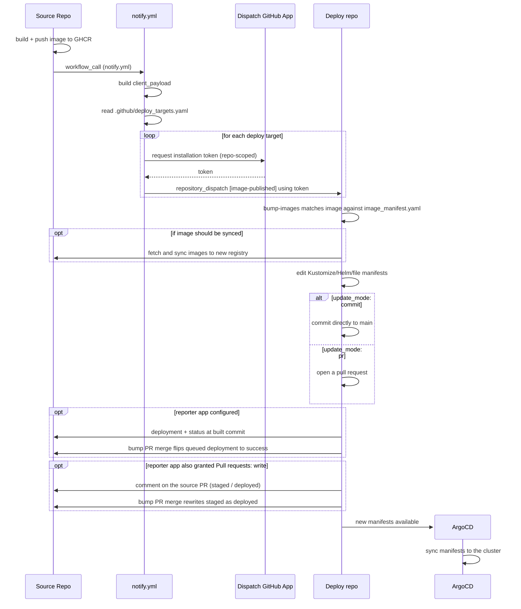

# Getting started

`odp-releaser` connects two repositories that normally can't reach each other: a
**source** repo that builds and pushes a container image, and a **deploy** repo
that owns the Kubernetes/Kustomize/Helm manifests referencing it. This page
covers what each side is responsible for, how to install the tool, and the
cross-cutting concerns — GitHub Apps, pinning, security, and validating your
config before a release.

## End-to-end flow



## Source repo or deployment repo?

The two sides need different things set up, and this documentation is split the
same way.

| | **[Source repo](source/index.md)** | **[Deployment repo](deploy/index.md)** |
| --- | --- | --- |
| Owns | the code and the image build | the deployment manifests |
| Config file | [`.github/deploy_targets.yaml`](source/deploy_targets.md) | [`.github/image_manifest.yaml`](deploy/image_manifest.md) |
| Workflows | [`notify.yml`](source/notify.md) | [`bump-images.yml`](deploy/bump_images.md), [`report-merged.yml`](deploy/report_merged.md) |
| GitHub App | [holds a dispatch app key](source/github_app.md) | [owns the dispatch and reporter apps](deploy/github_app.md) |

A repo could be both, but it's unlikely and untested.

## Installing

In CI you normally don't install anything by hand: the reusable workflows run
the [`install` composite action](api/actions.md), which installs the CLI from
the same checkout as the workflow you pinned.

To run the CLI locally — to generate a starter config, validate one, or dry-run
a bump — install it with [uv](https://docs.astral.sh/uv/):

```bash
uv tool install https://github.com/gulfofmaine/odp-releaser.git
```

Then generate a starter config for whichever side you're setting up:

```bash
odp-releaser generate-config deploy-targets   # source repo
odp-releaser generate-config image-manifest   # deploy repo
```

See the [CLI reference](api/cli.md) for everything else it can do, and
[Testing](development/testing.md) for exercising a config without dispatching
anything.

## The GitHub Apps, in brief

The default `GITHUB_TOKEN` a workflow gets is scoped to the repo it runs in, so
it can never reach across repos. Two GitHub App enable the cross-repo communication
while maintaining permission boundaries.

- The **dispatch app** enables the source repo to send image into to deploy repos.
  Each deploy org owns one, installs it only on its own deploy repos, and hands a private key to each
  source org it trusts. A source repo's `notify` job uses that key to mint a
  one-hour token scoped to a single deploy repository.
- The **reporter app** allows deploy repos to respond to source repos. It only ever needs
  `Deployments: Read and write` (plus `Pull requests: Read and write` if bumps
  should also comment), which makes a simpler model workable: one app owned by
  the deploy org, installed by each source org that wants reports.

Set-up instructions live with the side that does the work —
[source repo maintainers](source/github_app.md) and
[deploy org admins](deploy/github_app.md) — and the trust model, permission
reasoning, and token flows are in [GitHub Apps](api/github_apps.md).

## Versioning and pinning

Calling workflows should pin the `uses:` reference to a commit SHA
(`@<sha>`), not a branch (can be added as a comment ` # main` afterwards to allow dependency tracking). Both reusable workflows check out their own
repository at `${{ job.workflow_sha }}` (the commit of the reusable
workflow file that GitHub resolved for this run) and run the
[composite actions](api/actions.md) (and through them the `odp-releaser` CLI)
from that checkout. That keeps the workflow YAML, the actions, and the CLI they
invoke in lockstep.

## Security notes

- **Least privilege**: [`notify.yml`](source/notify.md) requests only
  `contents: read` and `pull-requests: read` at the job level (it only reads the
  calling repo and looks up an associated PR).
  [`bump-images.yml`](deploy/bump_images.md) requests `contents: write` and
  `pull-requests: write` — the minimum needed to commit or open a PR.
- **Per-target, short-lived tokens**: every dispatch mints a fresh installation
  token scoped to exactly one target repository with `contents: write`, valid
  for one hour, never persisted or logged. See the
  [token flow](api/github_apps.md#token-flow) in GitHub Apps.
- **Gate `notify` against forks and unrelated events.** Since `notify` needs
  real dispatch credentials to do anything useful, guard the job with an `if:`
  so it only runs for the repo and event you expect, e.g.:

  ```yaml
  if: ${{ github.repository == 'ioos/buoy_retriever' && github.event_name != 'pull_request' }}
  ```

  This keeps forked-repo pull requests (which shouldn't have access to your
  dispatch secrets in the first place, per GitHub's fork-PR secret rules) from
  ever reaching the `notify` step, and avoids sending dispatches for events you
  don't want to trigger a deploy.
- **`id-token: write` is a real privilege grant.** Every caller of
  `bump-images.yml` has to grant it, whether or not it syncs images — see
  [Syncing to ECR via OIDC](deploy/syncing.md#syncing-to-ecr-via-oidc) for why,
  and what to do instead if that trade isn't acceptable.

## Pre-commit hooks

Both config files can be checked offline before they're merged. This project ships pre-commit hooks that run those checks; in
a consumer repo's `.pre-commit-config.yaml`:

```yaml
repos:
  - repo: https://github.com/gulfofmaine/odp-releaser
    rev: "<pin to a released tag or commit SHA>"
    hooks:
      - id: validate-image-manifest
      - id: validate-deploy-targets
```

Each hook's default `files:` pattern only matches
`.github/image_manifest.ya?ml` or `.github/deploy_targets.ya?ml` respectively;
override `files:` on the hook entry if a config lives somewhere else.

The same checks are available as the `odp-releaser validate` CLI command, and
what each one catches is documented on the page for the config it checks —
[deploy targets](source/deploy_targets.md#what-is-checked) and
[image manifest](deploy/image_manifest.md#what-is-checked).

## Editor and JSON Schema support

`schemas/image_manifest.schema.json` and `schemas/deploy_targets.schema.json`
are generated from the same pydantic models
(`odp-releaser generate-config schema image-manifest|deploy-targets`) and
published alongside this project. Unlike the models themselves, the generated
schemas set `additionalProperties: false` on every object, so a generic JSON
Schema validator rejects unknown keys too.

Point an editor at them with a
[yaml-language-server](https://github.com/redhat-developer/yaml-language-server)
modeline at the top of the config file, for inline completion and
error-squiggles:

```yaml
# yaml-language-server: $schema=https://raw.githubusercontent.com/gulfofmaine/odp-releaser/main/schemas/image_manifest.schema.json
```

```yaml
# yaml-language-server: $schema=https://raw.githubusercontent.com/gulfofmaine/odp-releaser/main/schemas/deploy_targets.schema.json
```

Pin the URL to a released tag instead of `main` if reproducibility across time
matters more than always tracking the latest schema.

For a repo already using
[`check-jsonschema`](https://check-jsonschema.readthedocs.io/) in pre-commit
rather than (or alongside) the hooks above:

```yaml
repos:
  - repo: https://github.com/python-jsonschema/check-jsonschema
    rev: "<pin to a released tag or commit SHA>"
    hooks:
      - id: check-jsonschema
        name: Validate image_manifest.yaml
        files: ^\.github/image_manifest\.ya?ml$
        args:
          [
            "--schemafile",
            "https://raw.githubusercontent.com/gulfofmaine/odp-releaser/main/schemas/image_manifest.schema.json",
          ]
      - id: check-jsonschema
        name: Validate deploy_targets.yaml
        files: ^\.github/deploy_targets\.ya?ml$
        args:
          [
            "--schemafile",
            "https://raw.githubusercontent.com/gulfofmaine/odp-releaser/main/schemas/deploy_targets.schema.json",
          ]
```

The schema check and `odp-releaser validate` are complementary, not redundant:
the schema is strict about shape and unknown keys but knows nothing about this
project's runtime behavior, while `odp-releaser validate` is the more thorough
check. it verifies that referenced manifest files exist and parse, that
`yamlpath` selectors actually resolve against them, and that templated values
format successfully.
