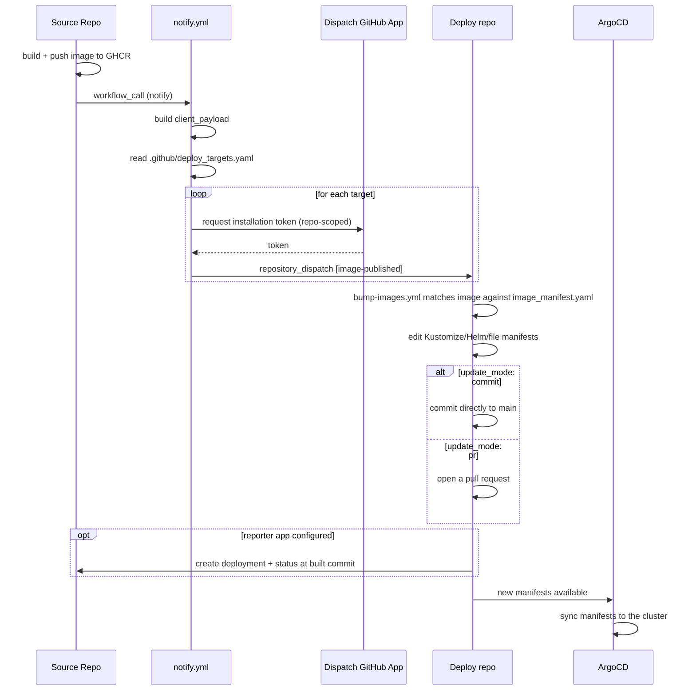

# Reusable Workflows

`odp-releaser` ships two reusable GitHub Actions workflows that together move
a container image from a **source** repo (builds and pushes the image) to any
number of **deploy** repos (own the Kubernetes/Kustomize/Helm manifests that
reference it). Both are called with the
[cross-repo `uses:` syntax](https://docs.github.com/en/actions/how-tos/reuse-automations/reuse-workflows#calling-a-reusable-workflow)
and both install the `odp-releaser` CLI to do the actual work.

## End-to-end flow



Everything below documents the two jobs in that diagram. The GitHub App
machinery that makes the cross-repo dispatch possible is covered separately
in [GitHub Apps](github_apps.md).

## Notify

Runs in the **source** repo, after an image has been built and pushed. Add
an `if:` to constrain it to the right repo, branch, and event so forks and
unrelated pushes don't dispatch anything (see [Security notes](#security-notes)).

### Caller example

```yaml
jobs:
  notify:
    needs: [shortsha, build_test_push]
    if: ${{ github.repository == 'ioos/buoy_retriever' && github.event_name != 'pull_request' }}
    uses: gulfofmaine/odp-releaser/.github/workflows/notify.yml@<sha-or-tag>
    permissions:
      contents: read
      pull-requests: read
    with:
      image_name: ghcr.io/ioos/buoy_retriever_hohonu
      tag: ${{ needs.shortsha.outputs.shortsha }}
      digest: ${{ needs.build_test_push.outputs.image_digest }}
      # environment: production                           # optional gate
      # deploy_targets_path: .github/deploy_targets.yaml  # optional
      # verbosity: 1                                       # optional, default
    secrets:
      dispatch_app_id: ${{ secrets.DISPATCH_APP_ID }}
      dispatch_app_private_key: ${{ secrets.DISPATCH_APP_PRIVATE_KEY }}
      # dispatch_apps: ${{ secrets.DISPATCH_APPS }}        # optional multi-org
```

Note the explicit `secrets:` block — `notify.yml` does **not** support
`secrets: inherit`, since it only ever needs the dispatch credentials named
above.

### Inputs

| Input | Required | Default | Description |
| --- | --- | --- | --- |
| `image_name` | yes | — | The image name exactly as your deployment manifests reference it. For Docker Hub this is `owner/name` (no `docker.io/` prefix); for other registries it must include the registry host (e.g. `ghcr.io/ioos/buoy_retriever_hohonu`). No tag or digest suffix. |
| `tag` | yes | — | Tag the image was published under. |
| `digest` | yes | — | Digest (`sha256:...`) of the published image. Must be a bare digest; a value still carrying a `repo@` prefix (e.g. from `docker inspect`'s `RepoDigests`) is rejected. |
| `environment` | no | `""` | GitHub environment used to gate the dispatch behind protection rules. Empty means no gating. |
| `deploy_targets_path` | no | `.github/deploy_targets.yaml` | Path to the deploy-targets file in the calling repo. |
| `verbosity` | no | `1` | CLI verbosity: `0`=warning, `1`=info (default), `2`+=debug. Maps to the CLI's `-v`/`-vv`/`-vvv` flags (capped at 3). |

### Secrets

| Secret | Required | Description |
| --- | --- | --- |
| `dispatch_app_id` | yes | App ID of the default GitHub App used to dispatch to deploy repos. |
| `dispatch_app_private_key` | yes | Private key of the default dispatch GitHub App. |
| `dispatch_apps` | no | JSON object mapping `owner -> {app_id, private_key}` for dispatching across multiple deploy orgs. |

See [GitHub Apps](github_apps.md) for where these credentials come from and
how to request them from a deploy org.

### The protected `environment` gate

Setting `environment` runs the job under that
[GitHub environment](https://docs.github.com/en/actions/how-tos/deploy/manage-environments/manage-environments-for-deployment),
so any protection rules configured there (required reviewers, wait timers,
branch restrictions) apply before a single dispatch is sent. Leave it empty
to skip gating entirely.

### `.github/deploy_targets.yaml`

A YAML array of deploy targets (a JSON array also parses — YAML is a
superset of JSON). Generate a starter file with
`odp-releaser generate-config deploy-targets`:

```yaml
- owner: gulfofmaine
  repo: some-deploy-repo
- owner: ioos
  repo: another-deploy-repo
  event_type: image-published # optional, this is the default
```

Each entry:

| Field | Required | Default | Description |
| --- | --- | --- | --- |
| `owner` | yes | — | Owner of the deploy repository. |
| `repo` | yes | — | Name of the deploy repository. |
| `event_type` | no | `image-published` | `repository_dispatch` event type to send. |

A missing file is an error: `notify` exits non-zero and suggests generating
one with `odp-releaser generate-config deploy-targets`. An existing file that
is empty or contains an empty array is a valid no-op — `notify` logs that
there's nothing to dispatch and exits successfully.

## Bump images

Runs in the **deploy** repo, triggered by the `repository_dispatch` event
that `notify` sends. It matches the incoming image against
`.github/image_manifest.yaml` and either commits the updated manifests
directly or opens a pull request, depending on that image's `update_mode`.
An image with no entry at all in `images` is treated as a configuration
error: `bump-images` exits non-zero and lists the images that are
configured. An image that has an entry but an empty list of configs is a
deliberate no-op and succeeds without changes.

### Caller example

```yaml
on:
  repository_dispatch:
    types: [image-published]

concurrency:
  group: bump-images-${{ github.event.client_payload.image_name }}
  cancel-in-progress: false

jobs:
  bump:
    uses: gulfofmaine/odp-releaser/.github/workflows/bump-images.yml@<sha-or-tag>
    with:
      # config_path: .github/image_manifest.yaml            # optional
      # git_user_name: odp-releaser[bot]                    # optional
      # git_user_email: odp-releaser[bot]@users.noreply.github.com
      # verbosity: 1                                       # optional, default
    secrets:
      ci_app_id: ${{ secrets.CI_APP_ID }} # optional
      ci_app_private_key: ${{ secrets.CI_APP_PRIVATE_KEY }} # optional
      reporter_app_id: ${{ secrets.REPORTER_APP_ID }} # optional
      reporter_app_private_key: ${{ secrets.REPORTER_APP_PRIVATE_KEY }} # optional
      # reporter_apps: ${{ secrets.REPORTER_APPS }}    # optional multi-org
```

Set the `concurrency` group at the **caller** level too (as above) — a burst
of dispatches for the same image shouldn't run two bump jobs in parallel and
race each other's commits. The reusable workflow itself also sets a job-level
`concurrency` group keyed on `client_payload.image_name`, but the caller-side
group protects against overlapping *workflow runs* triggered in quick
succession.

### Inputs

| Input | Required | Default | Description |
| --- | --- | --- | --- |
| `config_path` | no | `.github/image_manifest.yaml` | Path to the image manifest config file. |
| `git_user_name` | no | `odp-releaser[bot]` | Git author/committer name for direct commits. |
| `git_user_email` | no | `odp-releaser[bot]@users.noreply.github.com` | Git author/committer email for direct commits. |
| `verbosity` | no | `1` | CLI verbosity: `0`=warning, `1`=info (default), `2`+=debug. Maps to the CLI's `-v`/`-vv`/`-vvv` flags (capped at 3). |

### Secrets

| Secret | Required | Description |
| --- | --- | --- |
| `ci_app_id` | no | App ID of this repo's own GitHub App. When set, the commit/PR is authored with an app token instead of `GITHUB_TOKEN`. |
| `ci_app_private_key` | no | Private key matching `ci_app_id`. |
| `reporter_app_id` | no | App ID of the source org's reporter GitHub App. When set, a successful bump is reported back to the source repo as a GitHub deployment + status. |
| `reporter_app_private_key` | no | Private key matching `reporter_app_id`. |
| `reporter_apps` | no | JSON object mapping source `owner -> {app_id, private_key}` for reporting to source repos across multiple orgs. |

### `commit` vs `pull_request`

Each image in `.github/image_manifest.yaml` sets `update_mode: commit`
(default) or `update_mode: pull_request` per `ImageConfig` — see
[Image manifest config](config/image_manifest.md) for the full schema. In
`commit` mode the workflow pushes the manifest edits straight to the
checked-out branch (normally the default branch); in `pull_request` mode it
opens (or updates) a pull request on a stable branch named
`odp-releaser/bump-<image_name>` via `peter-evans/create-pull-request`.

### Reporting deployments back to the source repo

When the `reporter_app_id` / `reporter_app_private_key` (or `reporter_apps`)
secrets are set, a final step runs `odp-releaser report-deployment` after a
successful bump. It creates a
[GitHub deployment](https://docs.github.com/en/rest/deployments/deployments)
on the **source** repository at the commit that built the image
(`client_payload.git_sha`) and sets its status, so the source repo's pull
request timeline and Environments sidebar show where the image went.

- The deployment **state** mirrors what happened on the deploy side:
  `success` when the bump was committed directly, `queued` when a bump pull
  request was opened but not yet merged. Note this records that the manifest
  change landed — whether ArgoCD has synced it to a cluster is downstream of
  this tool.
- The **environment name** defaults to the deploy repo's `owner/name` slug;
  set `environment` in `.github/image_manifest.yaml` to override it (see
  [Image manifest config](config/image_manifest.md)).
- The "View deployment" link points at the bump commit (`commit` mode) or
  the bump pull request (`pull_request` mode); the logs link points at the
  bump workflow run.
- Reporting is **best-effort**: the step runs with `continue-on-error`, so a
  failed report never fails the bump itself.

The credentials belong to a source-org-owned **reporter app** with
`Deployments: Read and write` on the source repos — the mirror image of the
dispatch app. See
[GitHub Apps](github_apps.md#reporter-apps) for how to create one and share
its key.

### The `ci_app_*` PR-CI-triggering note

GitHub Actions deliberately does not trigger further workflow runs from a
commit or pull request authored with the default `GITHUB_TOKEN`. If any of
your images use `update_mode: pull_request`, that means your own CI would
never run against the bump PR unless the commit/PR is authored with a
GitHub App token instead. Passing `ci_app_id` / `ci_app_private_key` — your
deploy org's own dispatch app credentials — makes the workflow mint that
token before checkout, so the pushed commit and/or opened PR is authored by
your app and does trigger CI. See [GitHub Apps](github_apps.md#5-wire-your-own-app-into-bump-imagesyml-pr-mode-ci-trigger)
for how to obtain and wire those credentials.

## Versioning and pinning

Callers should pin the `uses:` reference to a tag or commit SHA
(`@<sha-or-tag>`), not a branch. Both reusable workflows install the
`odp-releaser` CLI from `git+https://github.com/gulfofmaine/odp-releaser` at
`${{ github.job_workflow_sha }}` — the exact commit of the reusable workflow
file that GitHub resolved for this run. That keeps the workflow YAML and the
CLI it invokes permanently in lockstep: pinning the workflow reference is
enough to pin the CLI version too, with no separate version input to keep in
sync.

## `client_payload.repo` and `allowed_source_repos`

Every dispatch carries `client_payload.repo` — the source repo's
`owner/name` slug — as its stable identifier for "who sent this" (see
[Client Payload](client_payload.md)). A deploy repo's
`.github/image_manifest.yaml` can set `allowed_source_repos` on the manifest
config to an explicit list of trusted `owner/name` slugs; `bump-images`
rejects (non-zero exit, no manifest changes) any payload whose `repo` isn't
in that list. This is the deploy repo's own defense-in-depth check,
independent of which source orgs the deploy org's dispatch app trusts — see
[Image manifest config](config/image_manifest.md) for the field and
[GitHub Apps](github_apps.md) for the credential-level trust boundary.

## Security notes

- **Least privilege**: `notify.yml` requests only `contents: read` and
  `pull-requests: read` at the job level (it only reads the calling repo and
  looks up an associated PR). `bump-images.yml` requests `contents: write`
  and `pull-requests: write` — the minimum needed to commit or open a PR.
- **Per-target, short-lived tokens**: every dispatch mints a fresh
  installation token scoped to exactly one target repository with
  `contents: write`, valid for one hour, never persisted or logged — see the
  [token flow](github_apps.md#token-flow) in GitHub Apps.
- **Gate `notify` against forks and unrelated events.** Since `notify` needs
  real dispatch credentials to do anything useful, guard the job with an
  `if:` so it only runs for the repo and event you expect, e.g.:

  ```yaml
  if: ${{ github.repository == 'ioos/buoy_retriever' && github.event_name != 'pull_request' }}
  ```

  This keeps forked-repo pull requests (which shouldn't have access to your
  dispatch secrets in the first place, per GitHub's fork-PR secret rules)
  from ever reaching the `notify` step, and avoids sending dispatches for
  events you don't want to trigger a deploy.
