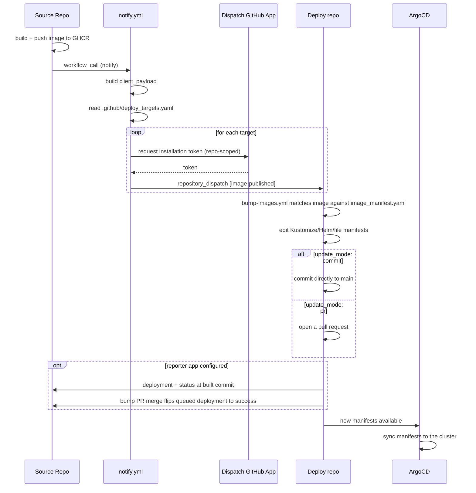

# Reusable Workflows

`odp-releaser` ships three reusable GitHub Actions workflows that together
move a container image from a **source** repo (builds and pushes the image)
to any number of **deploy** repos (own the Kubernetes/Kustomize/Helm
manifests that reference it) — and report back where it went. All are called
with the
[cross-repo `uses:` syntax](https://docs.github.com/en/actions/how-tos/reuse-automations/reuse-workflows#calling-a-reusable-workflow)
and all install the `odp-releaser` CLI to do the actual work. The install,
bump, and report steps are themselves packaged as
[composite actions](actions.md) that the workflows dog-food — use those
directly when you need to add your own steps around the bump.

## End-to-end flow



Everything below documents the jobs in that diagram. The GitHub App
machinery that makes the cross-repo dispatch and deployment reporting
possible is covered separately in [GitHub Apps](github_apps.md).

## Notify

Runs in the **source** repo, after an image has been built and pushed. Add
an `if:` to constrain it to the right repo, branch, and event so forks and
unrelated pushes don't dispatch anything (see [Security notes](#security-notes)).

### Caller example

```yaml
jobs:
  notify:
    needs: [shortsha, build_test_push]
    if: ${{ github.repository == 'ioos/buoy_retriever' && github.event_name != 'pull_request' }}
    uses: gulfofmaine/odp-releaser/.github/workflows/notify.yml@<sha-or-tag>
    permissions:
      contents: read
      pull-requests: read
    with:
      image_name: ghcr.io/ioos/buoy_retriever_hohonu
      tag: ${{ needs.shortsha.outputs.shortsha }}
      digest: ${{ needs.build_test_push.outputs.image_digest }}
      # environment: production                           # optional gate
      # deploy_targets_path: .github/deploy_targets.yaml  # optional
      # verbosity: 1                                       # optional, default
    secrets:
      dispatch_app_id: ${{ secrets.DISPATCH_APP_ID }}
      dispatch_app_private_key: ${{ secrets.DISPATCH_APP_PRIVATE_KEY }}
      # dispatch_apps: ${{ secrets.DISPATCH_APPS }}        # optional multi-org
```

Note the explicit `secrets:` block — `notify.yml` does **not** support
`secrets: inherit`, since it only ever needs the dispatch credentials named
above.

### Inputs

| Input | Required | Default | Description |
| --- | --- | --- | --- |
| `image_name` | yes | — | The image name exactly as your deployment manifests reference it. For Docker Hub this is `owner/name` (no `docker.io/` prefix); for other registries it must include the registry host (e.g. `ghcr.io/ioos/buoy_retriever_hohonu`). No tag or digest suffix. |
| `tag` | yes | — | Tag the image was published under. |
| `digest` | yes | — | Digest (`sha256:...`) of the published image. Must be a bare digest; a value still carrying a `repo@` prefix (e.g. from `docker inspect`'s `RepoDigests`) is rejected. |
| `environment` | no | `""` | GitHub environment used to gate the dispatch behind protection rules. Empty means no gating. |
| `deploy_targets_path` | no | `.github/deploy_targets.yaml` | Path to the deploy-targets file in the calling repo. |
| `verbosity` | no | `1` | CLI verbosity: `0`=warning, `1`=info (default), `2`+=debug. Maps to the CLI's `-v`/`-vv`/`-vvv` flags (capped at 3). |
| `dry_run` | no | `false` | Testing aid: resolve dispatch credentials for every target but send no dispatch events. |
| `event_name` | no | `""` | Testing aid: override the GitHub event name used to build the client payload. Empty uses the run's real event. Only `push`, `release`, and `workflow_dispatch` are supported; `workflow_dispatch` is the simplest override since it needs no event file, token, or PR lookup. |

### Secrets

| Secret | Required | Description |
| --- | --- | --- |
| `dispatch_app_id` | yes | App ID of the default GitHub App used to dispatch to deploy repos. |
| `dispatch_app_private_key` | yes | Private key of the default dispatch GitHub App. |
| `dispatch_apps` | no | JSON object mapping `owner -> {app_id, private_key}` for dispatching across multiple deploy orgs. |

See [GitHub Apps](github_apps.md) for where these credentials come from and
how to request them from a deploy org.

### Outputs

| Output | Description |
| --- | --- |
| `results` | JSON array of per-target dispatch results, each `{owner, repo, event_type, ok, detail}`. |
| `target_count` | Number of deploy targets that were attempted. |

### The protected `environment` gate

Setting `environment` runs the job under that
[GitHub environment](https://docs.github.com/en/actions/how-tos/deploy/manage-environments/manage-environments-for-deployment),
so any protection rules configured there (required reviewers, wait timers,
branch restrictions) apply before a single dispatch is sent. Leave it empty
to skip gating entirely.

### `.github/deploy_targets.yaml`

A YAML array of deploy targets (a JSON array also parses — YAML is a
superset of JSON). Generate a starter file with
`odp-releaser generate-config deploy-targets`:

```yaml
- owner: gulfofmaine
  repo: some-deploy-repo
- owner: ioos
  repo: another-deploy-repo
  event_type: image-published # optional, this is the default
```

Each entry:

| Field | Required | Default | Description |
| --- | --- | --- | --- |
| `owner` | yes | — | Owner of the deploy repository. |
| `repo` | yes | — | Name of the deploy repository. |
| `event_type` | no | `image-published` | `repository_dispatch` event type to send. |

A missing file is an error: `notify` exits non-zero and suggests generating
one with `odp-releaser generate-config deploy-targets`. A file that is empty
or contains an empty array is also an error — a targets file with nothing to
dispatch to is treated as a misconfiguration rather than a silent no-op, so
`notify` exits non-zero.

## Bump images

Runs in the **deploy** repo, triggered by the `repository_dispatch` event
that `notify` sends. It matches the incoming image against
`.github/image_manifest.yaml` and either commits the updated manifests
directly or opens a pull request, depending on that image's `update_mode`.
An image with no entry at all in `images` is treated as a configuration
error: `bump-images` exits non-zero and lists the images that are
configured. An image that has an entry but an empty list of configs is a
deliberate no-op and succeeds without changes.

### Caller example

```yaml
on:
  repository_dispatch:
    types: [image-published]

concurrency:
  group: bump-images-${{ github.event.client_payload.image_name }}
  cancel-in-progress: false

jobs:
  bump:
    uses: gulfofmaine/odp-releaser/.github/workflows/bump-images.yml@<sha-or-tag>
    with:
      # config_path: .github/image_manifest.yaml            # optional
      # git_user_name: odp-releaser[bot]                    # optional
      # git_user_email: odp-releaser[bot]@users.noreply.github.com
      # verbosity: 1                                       # optional, default
    secrets:
      ci_app_id: ${{ secrets.CI_APP_ID }} # optional
      ci_app_private_key: ${{ secrets.CI_APP_PRIVATE_KEY }} # optional
      reporter_app_id: ${{ secrets.REPORTER_APP_ID }} # optional
      reporter_app_private_key: ${{ secrets.REPORTER_APP_PRIVATE_KEY }} # optional
      # reporter_apps: ${{ secrets.REPORTER_APPS }}    # optional multi-org
```

Set the `concurrency` group at the **caller** level too (as above) — a burst
of dispatches for the same image shouldn't run two bump jobs in parallel and
race each other's commits. The reusable workflow itself also sets a job-level
`concurrency` group keyed on `client_payload.image_name`, but the caller-side
group protects against overlapping *workflow runs* triggered in quick
succession.

### Inputs

| Input | Required | Default | Description |
| --- | --- | --- | --- |
| `config_path` | no | `.github/image_manifest.yaml` | Path to the image manifest config file. |
| `git_user_name` | no | `odp-releaser[bot]` | Git author/committer name for direct commits. |
| `git_user_email` | no | `odp-releaser[bot]@users.noreply.github.com` | Git author/committer email for direct commits. |
| `verbosity` | no | `1` | CLI verbosity: `0`=warning, `1`=info (default), `2`+=debug. Maps to the CLI's `-v`/`-vv`/`-vvv` flags (capped at 3). |
| `client_payload` | no | `""` | Testing aid: explicit `client_payload` JSON string. Empty uses the triggering `repository_dispatch` event's payload. |
| `dry_run` | no | `false` | Testing aid: run the CLI with `--dry-run` (no manifest files written) and skip the commit and pull-request steps. Outputs are still produced. |

### Secrets

| Secret | Required | Description |
| --- | --- | --- |
| `ci_app_id` | no | App ID of this repo's own GitHub App. When set, the commit/PR is authored with an app token instead of `GITHUB_TOKEN`. Also needed for `team_reviewers` in the image manifest config: when that key is present, the token is minted with organization "Members: read" added, so the app must be granted that permission. |
| `ci_app_private_key` | no | Private key matching `ci_app_id`. |
| `reporter_app_id` | no | App ID of the source org's reporter GitHub App. When set, a successful bump is reported back to the source repo as a GitHub deployment + status, and `allowed_actors` team membership is checked with it (needs organization "Members: read"). |
| `reporter_app_private_key` | no | Private key matching `reporter_app_id`. |
| `reporter_apps` | no | JSON object mapping source `owner -> {app_id, private_key}` for reporting to (and checking `allowed_actors` teams against) source repos across multiple orgs. |

### Outputs

| Output | Description |
| --- | --- |
| `image_name` | Image name the bump ran for (no tag or digest). |
| `digest` | Digest (`sha256:...`) of the image the bump ran for. |
| `changed` | Whether any manifest content changed (`"true"`/`"false"`). |
| `update_mode` | Resolved update mode (`"commit"` or `"pull_request"`). |
| `environment` | GitHub environment name resolved from the image manifest config for deployment reporting; empty when unconfigured. |
| `environment_url` | Deployment "View deployment" URL resolved from the image manifest config; empty when unconfigured. |
| `branch_name` | Branch name a `pull_request`-mode bump uses (`odp-releaser/bump-<image_name>`). |
| `commit_message` | Full commit message for the bump. |
| `pr_title` | Title for the bump pull request. |
| `reviewers` | Comma-separated GitHub usernames requested as reviewers on the bump pull request; empty when none are configured. |
| `team_reviewers` | Comma-separated GitHub team slugs requested as reviewers on the bump pull request; empty when none are configured. |

Follow-up jobs in the calling workflow can consume these, e.g.:

```yaml
jobs:
  bump:
    uses: gulfofmaine/odp-releaser/.github/workflows/bump-images.yml@<sha-or-tag>

  report:
    needs: [bump]
    if: needs.bump.outputs.changed == 'true'
    runs-on: ubuntu-latest
    steps:
      - env:
          IMAGE_NAME: ${{ needs.bump.outputs.image_name }}
          DIGEST: ${{ needs.bump.outputs.digest }}
        run: echo "Bumped $IMAGE_NAME to $DIGEST"
```

To insert steps *between* the bump and the commit/PR (e.g. syncing the image
to another registry), use the [`bump_images` composite action](actions.md#bump_images)
with `stage_only: "true"` instead of this workflow.

### `commit` vs `pull_request`

Each image in `.github/image_manifest.yaml` sets `update_mode: commit`
(default) or `update_mode: pull_request` per `ImageConfig` — see
[Image manifest config](config/image_manifest.md) for the full schema. In
`commit` mode the workflow pushes the manifest edits straight to the
checked-out branch (normally the default branch); in `pull_request` mode it
opens (or updates) a pull request on a stable branch named
`odp-releaser/bump-<image_name>` via `peter-evans/create-pull-request`.

### Requesting reviewers on bump pull requests

`pull_request`-mode bumps can request reviews: set `reviewers` (GitHub
usernames) and/or `team_reviewers` (team slugs, no org prefix) — per image
config, or under `defaults:` to apply to every config. A config's own list
replaces the default (an explicit `[]` requests none); when several matching
configs disagree, the first in config order wins with a warning, mirroring
how `environment` resolves.

Requesting a **team** review needs a token with organization "Members:
read" — the default `GITHUB_TOKEN` can't do it. The workflow handles this
automatically: when the checked-out image manifest contains a
`team_reviewers` key, the `ci_app_id` app token is minted with that
permission added (grant the app the organization "Members: read" permission
first; without `ci_app_*` secrets team reviews can't be requested). One
upstream caveat from `peter-evans/create-pull-request`: a requested reviewer
who is the PR's author causes the request-review call to fail.

### Reporting deployments back to the source repo

When the `reporter_app_id` / `reporter_app_private_key` (or `reporter_apps`)
secrets are set, the [`report_deployment` composite
action](actions.md#report_deployment) runs after a successful bump. It
creates a
[GitHub deployment](https://docs.github.com/en/rest/deployments/deployments)
on the **source** repository at the commit that built the image
(`client_payload.git_sha`) and sets its status, so the source repo's pull
request timeline and Environments sidebar show where the image went.

- The deployment **state** mirrors what happened on the deploy side:
  `success` when the bump was committed directly, `queued` when a bump pull
  request was opened but not yet merged — call
  [`report-merged.yml`](#report-merged) from the deploy repo to flip it to
  `success` once the bump PR merges. Note this records that the manifest
  change landed — whether ArgoCD has synced it to a cluster is downstream of
  this tool.
- The **environment name** defaults to the deploy repo's `owner/name` slug;
  set `environment` in `.github/image_manifest.yaml` — per image config, or
  under `defaults:` as a repo-wide default — to override it (see
  [Image manifest config](config/image_manifest.md)).
- The **"View deployment" link** defaults to the bump commit (`commit` mode)
  or the bump pull request (`pull_request` mode); set `environment_url` in
  the image manifest config — again per image config or under `defaults:` —
  to point it at the running app instead (templated with `{new_tag}`,
  `{git_sha}`, and `{digest}`). The logs link points at the bump workflow
  run.
- Reporting is **best-effort**: the step runs with `continue-on-error`, so a
  failed report never fails the bump itself.

The credentials belong to a **reporter app** with `Deployments: Read and
write` installed on the source repos — normally a single app owned by the
deploy org and installed by each source org. See
[GitHub Apps](github_apps.md#reporter-apps) for how to set one up.

### The `ci_app_*` PR-CI-triggering note

GitHub Actions deliberately does not trigger further workflow runs from a
commit or pull request authored with the default `GITHUB_TOKEN`. If any of
your images use `update_mode: pull_request`, that means your own CI would
never run against the bump PR unless the commit/PR is authored with a
GitHub App token instead. Passing `ci_app_id` / `ci_app_private_key` — your
deploy org's own dispatch app credentials — makes the workflow mint that
token before checkout, so the pushed commit and/or opened PR is authored by
your app and does trigger CI. See [GitHub Apps](github_apps.md#5-wire-your-own-app-into-bump-imagesyml-pr-mode-ci-trigger)
for how to obtain and wire those credentials.

## Report merged

Runs in the **deploy** repo when a pull request closes. A `pull_request`-mode
bump reports its deployment to the source repo as `queued` — nothing is live
until the bump PR merges. This workflow un-queues it: it reads the report
metadata that `bump-images` embedded in the PR body (an invisible HTML
comment carrying the client payload, environment, and environment URL),
finds the queued deployment on the source repo for the same commit and
environment, and flips its status to `success`.

Deploy repos whose images all use `update_mode: commit` don't need this
workflow — commit-mode bumps report `success` immediately.

### Caller example

```yaml
on:
  pull_request:
    types: [closed]

jobs:
  report:
    if: >-
      github.event.pull_request.merged == true &&
      startsWith(github.event.pull_request.head.ref, 'odp-releaser/')
    uses: gulfofmaine/odp-releaser/.github/workflows/report-merged.yml@<sha-or-tag>
    secrets:
      reporter_app_id: ${{ secrets.REPORTER_APP_ID }}
      reporter_app_private_key: ${{ secrets.REPORTER_APP_PRIVATE_KEY }}
      # reporter_apps: ${{ secrets.REPORTER_APPS }}  # optional multi-org
```

The `if:` gate matches merged pull requests on the stable
`odp-releaser/bump-<image_name>` branches that `bump-images` uses. A PR
without embedded odp-releaser metadata is a friendly no-op (the job logs
"nothing to report" and succeeds), so a broader gate is safe — the branch
prefix check just avoids spinning up jobs for unrelated PRs.

If a merged bump PR's report is ever missed (e.g. the secrets weren't
configured yet), re-running is safe: reporting is idempotent, reusing the
existing deployment for the same commit + environment rather than creating
duplicates.

### Inputs

| Input | Required | Default | Description |
| --- | --- | --- | --- |
| `verbosity` | no | `1` | CLI verbosity: `0`=warning, `1`=info (default), `2`+=debug. Maps to the CLI's `-v`/`-vv`/`-vvv` flags (capped at 3). |

### Secrets

| Secret | Required | Description |
| --- | --- | --- |
| `reporter_app_id` | no | App ID of the reporter GitHub App installed on the source repos. |
| `reporter_app_private_key` | no | Private key matching `reporter_app_id`. |
| `reporter_apps` | no | JSON object mapping source `owner -> {app_id, private_key}` for reporting to source repos across multiple orgs. |

## Versioning and pinning

Callers should pin the `uses:` reference to a tag or commit SHA
(`@<sha-or-tag>`), not a branch. Both reusable workflows check out their own
repository at `${{ job.workflow_sha }}` — the exact commit of the reusable
workflow file that GitHub resolved for this run — and run the
[composite actions](actions.md) (and through them the `odp-releaser` CLI)
from that checkout. That keeps the workflow YAML, the actions, and the CLI
they invoke permanently in lockstep: pinning the workflow reference is
enough to pin everything else too, with no separate version input to keep in
sync.

## Self-testing (e2e CI)

This repo's own CI (`.github/workflows/ci.yml`) exercises both reusable
workflows end-to-end on every pull request, using the testing-aid inputs
documented above:

- `e2e-notify` calls `notify.yml` with `dry_run: true`,
  `event_name: workflow_dispatch`, dummy dispatch credentials, and the
  fixture targets in `tests/e2e/deploy_targets.yaml`. Credentials are
  resolved for every target but nothing is dispatched; the job fails if any
  target's credentials can't be resolved, and its `results`/`target_count`
  outputs are asserted downstream.
- `e2e-payload` installs the CLI from the PR's checkout and generates real
  client payloads with `odp-releaser test make-payload`.
- `e2e-bump-commit` / `e2e-bump-pr` call `bump-images.yml` with those
  payloads, `dry_run: true`, and the fixture config in
  `tests/e2e/image_manifest.yaml` (one image per update mode, covering both
  kustomize pin styles).
- `e2e-assert` checks the workflows' outputs: notify's `results` (both
  targets attempted, all ok, dry-run detail) and `target_count`, plus
  bump-images' `image_name`, `digest`, `changed`, `update_mode`,
  `commit_message`, `pr_title`, and `branch_name`.

Because the reusable workflows are called locally (`uses: ./.github/...`),
each PR run also proves the real production path against the PR's own
commit: the checkout of this repo at `job.workflow_sha`, both
[composite actions](actions.md), and the CLI they install from that
checkout.

## Allowed source repos and actors

Every dispatch carries `client_payload.repo` — the source repo's
`owner/name` slug — and `client_payload.source.actor` — the GitHub user who
triggered the source build — as its identifiers for "who sent this" (see
[Client Payload](client_payload.md)). A deploy repo's
`.github/image_manifest.yaml` can restrict both per `ImageConfig`:

- `allowed_source_repos`: trusted `owner/name` slugs.
- `allowed_actors`: a mapping with `users` (GitHub usernames, compared
  case-insensitively) and/or `teams` (`org/team-slug` entries). Teams live
  in the source orgs, so membership is checked with the same
  [reporter app](github_apps.md#reporter-apps) credentials
  (`reporter_apps` / `reporter_app_id` / `reporter_app_private_key`) that
  deployment reporting uses — grant the reporter app the organization
  "Members: read" permission for this.

Both can also be set under `defaults:` to apply to every config; a config's
own value replaces the default entirely (an empty list denies everyone).
Leaving a resolved value unset disables that check.

A config whose allowlists reject the payload is skipped with a warning, so
other configs for the same image can still apply — e.g. anyone may bump a
dev overlay while only release managers reach production. When every
event-matched config for the image rejects the payload, `bump-images` fails
(non-zero exit, no manifest changes) so unauthorized attempts are loud.

To share allowlists between configs, use YAML anchors and merge keys —
top-level `x-` keys are ignored by the schema:

```yaml
x-prod-guards: &prod-guards
  allowed_source_repos: [gulfofmaine/Neracoos-1-Buoy-App]
  allowed_actors:
    users: [abkfenris]
    teams: [gulfofmaine/deployers]

images:
  gmri/neracoos-mariners-dashboard:
    - <<: *prod-guards
      events: [release]
      kustomize_manifests:
        - ../apps/mariners/kustomization.yaml
```

This is the deploy repo's own defense-in-depth check, independent of which
source orgs the deploy org's dispatch app trusts — see
[Image manifest config](config/image_manifest.md) for the fields and
[GitHub Apps](github_apps.md) for the credential-level trust boundary.

## Security notes

- **Least privilege**: `notify.yml` requests only `contents: read` and
  `pull-requests: read` at the job level (it only reads the calling repo and
  looks up an associated PR). `bump-images.yml` requests `contents: write`
  and `pull-requests: write` — the minimum needed to commit or open a PR.
- **Per-target, short-lived tokens**: every dispatch mints a fresh
  installation token scoped to exactly one target repository with
  `contents: write`, valid for one hour, never persisted or logged — see the
  [token flow](github_apps.md#token-flow) in GitHub Apps.
- **Gate `notify` against forks and unrelated events.** Since `notify` needs
  real dispatch credentials to do anything useful, guard the job with an
  `if:` so it only runs for the repo and event you expect, e.g.:

  ```yaml
  if: ${{ github.repository == 'ioos/buoy_retriever' && github.event_name != 'pull_request' }}
  ```

  This keeps forked-repo pull requests (which shouldn't have access to your
  dispatch secrets in the first place, per GitHub's fork-PR secret rules)
  from ever reaching the `notify` step, and avoids sending dispatches for
  events you don't want to trigger a deploy.
